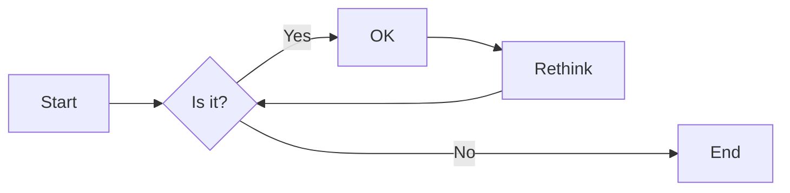
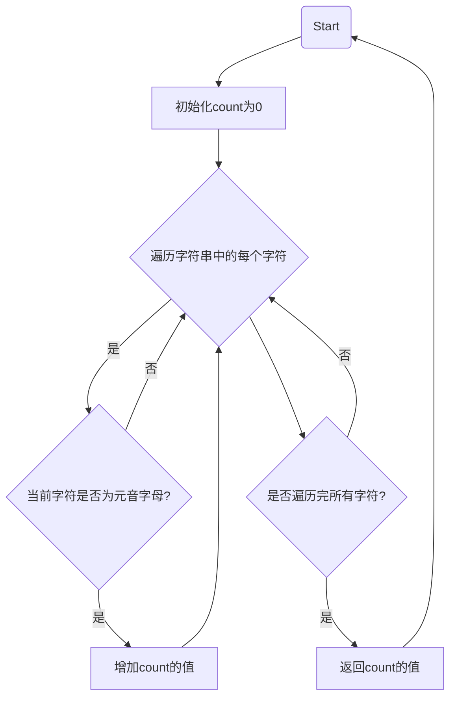

# 实验二 Python变量、简单数据类型

班级： 21计科2班

学号： B20210302206

姓名： 曾子涵

Github地址：<https://github.com/zzhhjjoo/zzh_warehouse>

CodeWars地址：<https://www.codewars.com/users/zzihan>

---

## 实验目的

1. 使用VSCode编写和运行Python程序
2. 学习Python变量和简单数据类型

## 实验环境

1. Git
2. Python 3.10
3. VSCode
4. VSCode插件

## 实验内容和步骤

### 第一部分

实验环境的安装

1. 安装Python，从Python官网下载Python 3.10安装包，下载后直接点击可以安装：[Python官网地址](https://www.python.org/downloads/)
2. 为了在VSCode集成环境下编写和运行Python程序，安装下列VScode插件
   - Python
   - Python Environment Manager
   - Python Indent
   - Python Extended
   - Python Docstring Generator
   - Jupyter
   - indent-rainbow
   - Jinja

---

### 第二部分

Python变量、简单数据类型和列表简介

完成教材《Python编程从入门到实践》下列章节的练习：

- 第2章 变量和简单数据类型

---

### 第三部分

在[Codewars网站](https://www.codewars.com)注册账号，完成下列Kata挑战：

---

#### 第1题：求离整数n最近的平方数（Find Nearest square number）

难度：8kyu

你的任务是找到一个正整数n的最近的平方数
例如，如果n=111，那么nearest_sq(n)（nearestSq(n)）等于121，因为111比100（10的平方）更接近121（11的平方）。
如果n已经是完全平方（例如n=144，n=81，等等），你需要直接返回n。
代码提交地址
<https://www.codewars.com/kata/5a805d8cafa10f8b930005ba>

---

#### 第2题：弹跳的球（Bouncing Balls）

难度：6kyu

一个孩子在一栋高楼的第N层玩球。这层楼离地面的高度h是已知的。他把球从窗口扔出去。球弹了起来,  例如:弹到其高度的三分之二（弹力为0.66）。他的母亲从离地面w米的窗户向外看,母亲会看到球在她的窗前经过多少次（包括球下落和反弹的时候）？

一个有效的实验必须满足三个条件：

- 参数 "h"（米）必须大于0
- 参数 "bounce "必须大于0且小于1
- 参数 “window "必须小于h。

如果以上三个条件都满足，返回一个正整数，否则返回-1。
**注意:只有当反弹球的高度严格大于窗口参数时，才能看到球。**
代码提交地址
<https://www.codewars.com/kata/5544c7a5cb454edb3c000047/train/python>

---

#### 第3题： 元音统计(Vowel Count)

难度： 7kyu

返回给定字符串中元音的数量（计数）。对于这个Kata，我们将考虑a、e、i、o、u作为元音（但不包括y）。输入的字符串将只由小写字母和/或空格组成。

代码提交地址：
<https://www.codewars.com/kata/54ff3102c1bad923760001f3>

---

#### 第4题：偶数或者奇数（Even or Odd）

难度：8kyu

创建一个函数接收一个整数作为参数，当整数为偶数时返回”Even”当整数位奇数时返回”Odd”。
代码提交地址：
<https://www.codewars.com/kata/53da3dbb4a5168369a0000fe>

### 第四部分

使用Mermaid绘制程序流程图

安装Mermaid的VSCode插件：

- Markdown Preview Mermaid Support
- Mermaid Markdown Syntax Highlighting

程序流程图：



查看Mermaid流程图语法-->[点击这里](https://mermaid.js.org/syntax/flowchart.html)

使用Markdown编辑器（例如VScode）编写本次实验的实验报告，包括[实验过程与结果](#实验过程与结果)、[实验考查](#实验考查)和[实验总结](#实验总结)，并将其导出为 **PDF格式** 来提交。

## 实验过程与结果

请将实验过程与结果放在这里，包括：

- [第二部分 Python变量、简单数据类型和列表简介](#第二部分)
- [第三部分 Codewars Kata挑战](#第三部分)
- [第四部分 使用Mermaid绘制程序流程图](#第四部分)
  
第1题：求离整数n最近的平方数（Find Nearest square number）

```python
import math
def nearest_sq(n):
    sq = int(math.sqrt(n))
    if sq * sq == n:
        return n
    else:
        if (n - sq * sq) < ((sq + 1) * (sq + 1) - n):
            return sq * sq
        else:
            return (sq + 1) * (sq + 1)
    n = 111
    result = nearest_sq(n)
    print(result)
    n = 81
    result = nearest_sq(n)
    print(result)
```

第2题：弹跳的球（Bouncing Balls

```python
def bouncingBall(h, bounce, window):
    if h <= 0 or bounce <= 0 or bounce >= 1 or window >= h:
        return -1
    count = 0
    while h > window:
        count += 1
        h *= bounce
        if h > window:
            count += 1
    return count
    h = 3
    bounce = 0.66
    window = 1.5
    result = bouncingBall(h, bounce, window)
    print(result)
    h = 3
    bounce = 1
    window = 1.5
    result = bouncingBall(h, bounce, window)
    print(result)
```

第3题： 元音统计(Vowel Count)

```python
def getCount(string):
    vowels = "aeiou"
    count = 0
    for char in string:
        if char.lower() in vowels:
            count += 1
    return count

    string = "hello world"
    result = getCount(string)
    print(result)

    string = "python programming"
    result = getCount(string)
    print(result)
```



第4题：偶数或者奇数（Even or Odd）

```python
def even_or_odd(number):
    if number % 2 == 0:
        return "Even"
    else:
        return "Odd"

    result = even_or_odd(4)
    print(result)

    result = even_or_odd(7)
    print(result)
```


## 实验考查

请使用自己的语言并使用尽量简短代码示例回答下面的问题，这些问题将在实验检查时用于提问和答辩以及实际的操作。

1. Python中的简单数据类型有那些？我们可以对这些数据类型做哪些操作？
2. 为什么说Python中的变量都是标签？
3. 有哪些方法可以提高Python代码的可读性？

- 1.Python中的简单数据类型包括整数(int)、浮点数(float)、布尔值(bool)、字符串(str)等。我们可以对这些数据类型进行基本的运算、比较、逻辑操作等

- 2.Python中的变量本质上是一个标签，它指向存储在内存中的某个对象。当我们给一个变量赋值时，实际上是让这个变量所指向的对象的标签指向了一个新的对象。因此，Python中的变量都是标签，而不是存储数据的容器。

- 3.使用有意义的变量名和函数名，能够清晰地表达变量或函数所代表的含义。
缩进代码块，使用统一的缩进风格，能够使代码结构更加清晰。
在代码中添加注释，使用空格和空行来分隔代码块，使代码更加易读。

## 实验总结

在这次实验中，我学习和使用了以下知识：Python编程工具的使用、字符串数据结构的操作、Python程序语言的基本语法、简单的算法实现、编程技巧如函数封装和条件语句的使用、编程思想如迭代思想的应用。