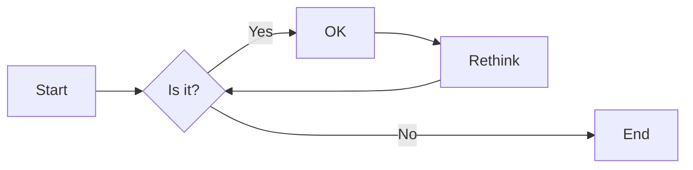

# 实验三 Python列表

班级： 21计科2

学号： 20210302206

姓名：曾子涵

Github地址：<https://github.com/zzhhjjoo/zzh_warehouse>

CodeWars地址：<https://www.codewars.com/users/zzihan>

---

## 实验目的

1. 学习Python的简单使用和列表操作
2. 学习Python中的if语句

## 实验环境

1. Git
2. Python 3.10
3. VSCode
4. VSCode插件

## 实验内容和步骤

### 第一部分

Python列表操作

完成教材《Python编程从入门到实践》下列章节的练习：

- 第3章 列表简介
- 第4章 操作列表
- 第5章 if语句

---

### 第二部分

在[Codewars网站](https://www.codewars.com)注册账号，完成下列Kata挑战：

---

#### 第一题：3和5的倍数（Multiples of 3 or 5）

难度： 6kyu

如果我们列出所有低于 10 的 3 或 5 倍数的自然数，我们得到 3、5、6 和 9。这些数的总和为 23. 完成一个函数，使其返回小于某个整数的所有是3 或 5 的倍数的数的总和。此外，如果数字为负数，则返回 0。

注意：如果一个数同时是3和5的倍数，应该只被算一次。

**提示：首先使用列表解析得到一个列表，元素全部是3或者5的倍数。
使用sum函数可以获取这个列表所有元素的和.**

代码提交地址：
<https://www.codewars.com/kata/514b92a657cdc65150000006>

---

#### 第二题： 重复字符的编码器（Duplicate Encoder）

难度： 6kyu

本练习的目的是将一个字符串转换为一个新的字符串，如果新字符串中的每个字符在原字符串中只出现一次，则为"("，如果该字符在原字符串中出现多次，则为")"。在判断一个字符是否是重复的时候，请忽略大写字母。

例如:

```python
"din"      =>  "((("
"recede"   =>  "()()()"
"Success"  =>  ")())())"
"(( @"     =>  "))(("
```

代码提交地址:
<https://www.codewars.com/kata/54b42f9314d9229fd6000d9c>

---

#### 第三题：括号匹配（Valid Braces）

难度：6kyu

写一个函数，接收一串括号，并确定括号的顺序是否有效。如果字符串是有效的，它应该返回True，如果是无效的，它应该返回False。
例如：

```python
"(){}[]" => True 
"([{}])" => True
 "(}" => False
 "[(])" => False 
"[({})](]" => False
```

**提示：
python中没有内置堆栈数据结构，可以直接使用`list`来作为堆栈，其中`append`方法用于入栈，`pop`方法可以出栈。**

代码提交地址
<https://www.codewars.com/kata/5277c8a221e209d3f6000b56>

---

#### 第四题： 从随机三元组中恢复秘密字符串(Recover a secret string from random triplets)

难度： 4kyu

有一个不为你所知的秘密字符串。给出一个随机三个字母的组合的集合，恢复原来的字符串。

这里的三个字母的组合被定义为三个字母的序列，每个字母在给定的字符串中出现在下一个字母之前。"whi "是字符串 "whatisup "的一个三个字母的组合。

作为一种简化，你可以假设没有一个字母在秘密字符串中出现超过一次。

对于给你的三个字母的组合，除了它们是有效的三个字母的组合以及它们包含足够的信息来推导出原始字符串之外，你可以不做任何假设。特别是，这意味着秘密字符串永远不会包含不出现在给你的三个字母的组合中的字母。

测试用例：

```python
secret = "whatisup"
triplets = [
  ['t','u','p'],
  ['w','h','i'],
  ['t','s','u'],
  ['a','t','s'],
  ['h','a','p'],
  ['t','i','s'],
  ['w','h','s']
]
test.assert_equals(recoverSecret(triplets), secret)
```

代码提交地址：
<https://www.codewars.com/kata/53f40dff5f9d31b813000774/train/python>

提示：

- 利用集合去掉`triplets`中的重复字母，得到字母集合`letters`，最后的`secret`应该由集合中的字母组成，`secret`长度也等于该集合。

```python
letters = {letter for triplet in triplets for letter in triplet }
length = len(letters)
```

- 创建函数`check_first_letter(triplets, first_letter)`，检测一个字母是不是secret的首字母，返回True或者False。
- 创建函数`remove_first_letter(triplets, first_letter)`,  从三元组中去掉首字母，返回新的三元组。
- 遍历字母集合letters，利用上面2个函数得到最后的结果`secret`。

---

#### 第五题： 去掉喷子的元音（Disemvowel Trolls）

难度： 7kyu

喷子正在攻击你的评论区!
处理这种情况的一个常见方法是删除喷子评论中的所有元音(字母：a,e,i,o,u)，以消除威胁。
你的任务是写一个函数，接收一个字符串并返回一个去除所有元音的新字符串。
例如，字符串 "This website is for losers LOL!"   将变成 "Ths wbst s fr lsrs LL!".

注意：对于这个Kata来说，y不被认为是元音。
代码提交地址：
<https://www.codewars.com/kata/52fba66badcd10859f00097e>

提示：

- 首先使用列表解析得到一个列表，列表中所有不是元音的字母。
- 使用字符串的join方法连结列表中所有的字母，例如：

```python
last_name = "lovelace"
letters = [letter for letter in last_name ]
print(letters) # ['l', 'o', 'v', 'e', 'l', 'a', 'c', 'e']
name = ''.join(letters) # name = "lovelace"
```

---

### 第三部分

使用Mermaid绘制程序流程图

安装VSCode插件：

- Markdown Preview Mermaid Support
- Mermaid Markdown Syntax Highlighting

使用Markdown语法绘制你的程序绘制程序流程图（至少一个），Markdown代码如下：

[程序流程图]

显示效果如下：



查看Mermaid流程图语法-->[点击这里](https://mermaid.js.org/syntax/flowchart.html)

使用Markdown编辑器（例如VScode）编写本次实验的实验报告，包括[实验过程与结果](#实验过程与结果)、[实验考查](#实验考查)和[实验总结](#实验总结)，并将其导出为 **PDF格式** 来提交。

## 实验过程与结果

请将实验过程与结果放在这里，包括：

- [第一部分 Python列表操作和if语句](#第一部分)
- [第二部分 Codewars Kata挑战](#第二部分)
- [第三部分 使用Mermaid绘制程序流程图](#第三部分)

第一题：3和5的倍数（Multiples of 3 or 5）

```python
def solution(number):
    if number < 0:
        return 0
    else:
        result = 0
        for i in range(number):
            if i % 3 == 0 or i % 5 == 0:
                result += i
        return result
```

```Mermaid
graph TB
A[开始] --> B{number < 0?}
B -- 是 --> C[返回0]
B -- 否 --> D[result = 0]
D --> E[循环 i 从 0 到 number-1]
E --> F{i 能被 3 整除或者能被 5 整除?}
F -- 是 --> G[result += i]
F -- 否 --> E
E --> H[循环结束]
H --> I[返回 result]
```

第二题： 重复字符的编码器（Duplicate Encoder）

```python
def duplicate_encode(word):
    word = word.lower()
    new_word = ""
    for char in word:
        if word.count(char) == 1:
            new_word += "("
        else:
            new_word += ")"
    return new_word
```

第三题：括号匹配（Valid Braces）

```python
def valid_braces(string):
    stack = []
    braces = {'(': ')', '[': ']', '{': '}'}
    for char in string:
        if char in braces.keys():
            stack.append(char)
        elif char in braces.values():
            if len(stack) == 0 or braces[stack.pop()] != char:
                return False
    return len(stack) == 0
```

第五题： 去掉喷子的元音（Disemvowel Trolls）

```python
def disemvowel(string):
    vowels = ['a', 'e', 'i', 'o', 'u', 'A', 'E', 'I', 'O', 'U']
    new_string = ''
    for char in string:
        if char not in vowels:
            new_string += char
    return new_string
```

## 实验考查

请使用自己的语言并使用尽量简短代码示例回答下面的问题，这些问题将在实验检查时用于提问和答辩以及实际的操作。

1. Python中的列表可以进行哪些操作？

- 添加元素：使用append()方法将元素添加到列表末尾，使用insert()方法在指定位置插入元素。
- 访问元素：使用索引来访问列表中的元素，索引从0开始。
- 修改元素：通过索引直接修改列表中的元素。
- 删除元素：使用remove()方法删除指定元素，使用pop()方法删除指定索引位置的元素。
- 切片操作：通过切片操作可以获取列表的子列表。
- 长度和计数：使用len()函数获取列表的长度，使用count()方法统计指定元素在列表中出现的次数。

2. 哪两种方法可以用来对Python的列表排序？这两种方法有和区别？

- 两种常见的方法对Python的列表进行排序是使用sort()方法和sorted()函数。它们的区别如下：
- sort()方法是对原列表进行就地排序，即直接修改原列表。它返回值为None。
- sorted()函数是对原列表进行排序并返回一个新的已排序列表，原列表不变。

3. 如何将Python列表逆序打印？

- 将Python列表逆序打印可以使用切片操作

```python
my_list = [1, 2, 3, 4, 5]
reversed_list = my_list[::-1]
print(reversed_list)
```

4. Python中的列表执行哪些操作时效率比较高？哪些操作效率比较差？是否有类似的数据结构可以用来替代列表？

- 列表执行以下操作时效率较高：
访问元素：由于列表的元素是通过索引进行存储和访问的，因此可以在常量时间内访问列表中的任意元素。
添加元素：在列表末尾添加元素的时间复杂度为O(1)。
- 列表执行以下操作时效率较低：
插入和删除元素：在列表的开头或中间插入或删除元素的时间复杂度为O(n)，其中n是列表的长度。这是因为在插入或删除元素后，需要将后续元素进行移动。
列表的大小调整：当列表的大小超过当前分配的空间时，需要重新分配更大的空间，并将现有元素复制到新的空间中。这个操作的时间复杂度为O(n)。
- 如果需要在插入和删除元素时具有较高的效率，可以考虑使用链表（LinkedList）这样的数据结构来替代列表。

5. 阅读《Fluent Python》Chapter 2. An Array of Sequence - Tuples Are Not Just Immutable Lists小节（p30-p35）。总结该小节的主要内容。

- 元组是不可变的序列，而列表是可变的序列。
- 元组可以作为字典的键，而列表不能。
- 元组可以作为函数的参数和返回值，可以用于多重赋值。
- 列表是一种动态数组，可以进行增删改查等操作。
- 列表可以包含任意类型的元素，而元组可以包含不同类型的元素。
- 列表和元组都支持切片操作，可以用于获取子序列。
- 列表和元组都可以进行迭代和循环操作。

## 实验总结

- 在这次实验中，我学习和使用到了Python编程语言进行实验，使用Python的列表和元组数据结构。
- 学习了列表和元组这两种序列类型的特点和用法。了解了列表的可变性和元组的不可变性，以及它们在字典、函数参数和返回值、解包和命名元组等方面的应用。
- 学习了Python中列表和元组的创建、访问、修改、添加、删除、切片、迭代和循环等操作的语法。
- 学习了对列表进行排序的方法，包括使用sort()方法和sorted()函数。
- 学习了如何将列表逆序打印，使用切片操作实现。
- 了解了列表和元组在不同场景下的适用性，以及它们的优势和劣势。
- 通过这次实验，我对Python中的列表和元组有了更深入的了解，并学会了使用它们进行常见操作和解决问题。
